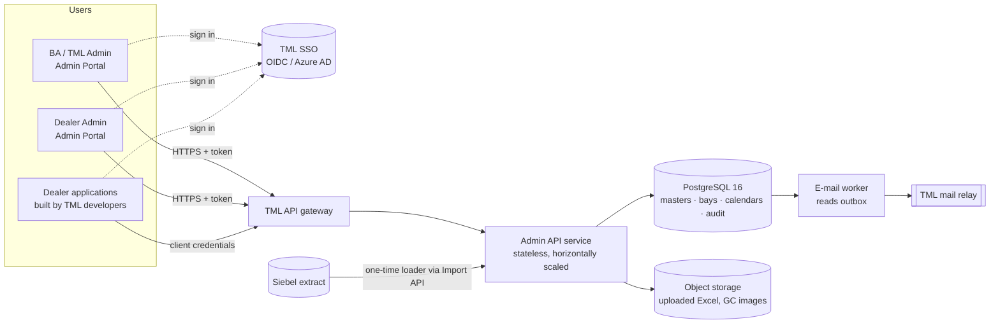
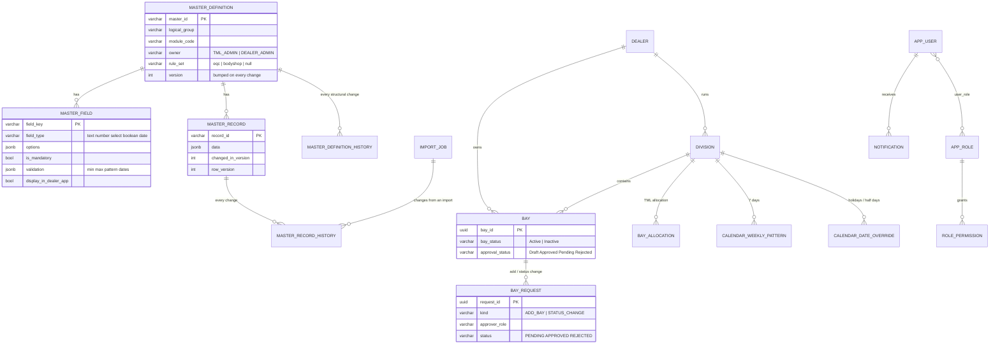
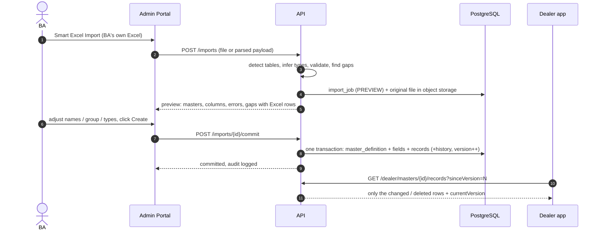
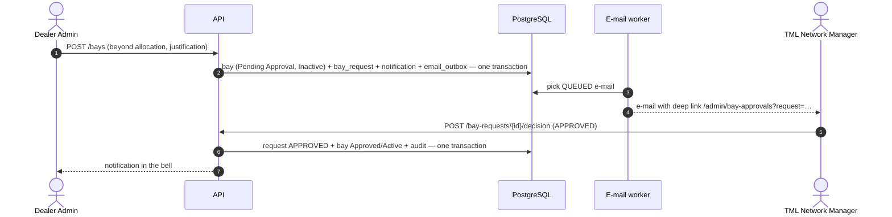

# Backend Design — TML Service Transformation Admin Portal

| | |
| --- | --- |
| **API contract** | [`public/api-docs/openapi.yaml`](../../public/api-docs/openapi.yaml), browsable at **`<portal>/api-docs/`** on the live site |
| **Database** | [`schema.sql`](schema.sql) (PostgreSQL 16) + self-checking tests [`schema_test.sql`](schema_test.sql), run in CI on every change |
| **Business rules** | Already written and unit-tested in the portal: `src/utils/eqcRules.ts`, `bodyshopRules.ts`, `bayGovernance.ts`, `holidayCalendar.ts`, `masterValidationSchema.ts`, `smartExcelImport.ts` |
| **Status** | Design ready for review by TML IT / architecture. Today the portal keeps data in each user's browser; this backend makes it shared and production-grade. |

---

## 1. The idea in one picture

**Masters are data, not tables.** A new master, or a field the BAs missed, is a row in `master_definition` / `master_field`,
and its rows are JSON in `master_record`. That's why the pending BA masters **do not block** the backend: when they
arrive they are uploaded (Smart Excel Import) as data. No new tables, APIs or deployments are needed.



## 2. Key decisions

| Decision | Why |
| --- | --- |
| **Generic master engine** (definition + fields + JSONB records) | BAs add masters and fields at run time, so the backend does too. One set of endpoints serves every master. |
| **PostgreSQL 16 + JSONB** | Relational integrity for workflows (bays, approvals) plus flexible master rows; GIN index for JSON lookups; widely supported by TML IT. |
| **Version number per master** (`master_definition.version`, `master_record.changed_in_version`) | Dealer apps sync only what changed since their last version, which suits 580+ dealers polling. |
| **Business rules run on the server** (`/rules/eqc/resolve`, `/rules/bodyshop/inventory-capture`) | Dealer apps never re-implement "blank PPL = all PPLs" etc.; one source of truth. The rule code is ported from the portal with its unit tests. |
| **Preview → commit for every import** | BAs see every error and gap (with Excel row numbers) before anything is saved; the commit is all-or-nothing. |
| **Transactional e-mail outbox** | The approval e-mail is written in the same transaction as the request, so it is never lost or sent for a rolled-back change. |
| **Row-level security** for dealer users | A Dealer Admin can only see and change their own dealer's rows, enforced in the database as well as the API. |
| **Append-only audit log** (trigger blocks UPDATE/DELETE) | Required for governance; also feeds the portal's Audit Log and Change Log. |
| **Optimistic locking** (`ETag` / `If-Match`) | Two admins editing the same row never silently overwrite each other. |

## 3. Data model



Rules enforced **inside the database** (all proven by `schema_test.sql`):

- master id / field key format; `id` is reserved; a dropdown needs 2+ options; record data must be an object
- only **Approved** bays can be **Active**; bay names are unique per dealer (case-insensitive)
- **one open request per bay**; a **rejection needs a note**; a status change needs from/to
- allocation 0–500; calendar open < close; an hours override needs both times
- audit log cannot be edited or deleted; every record change bumps the master version and writes history
- dealer users see only their own dealer (row-level security)

## 4. How a new master flows (no deployment)



## 5. Bay approval flow



Status changes follow the same pattern, with **TML Admin (L1/L2)** as approver. The *Bay status policy* switches
(`/bay-policy`) decide whether a Dealer Admin may change status, and whether it needs approval.

## 6. Validation layers (same rules as the portal, never weaker)

1. **Field rules** from `master_field`: type, mandatory, dropdown options, min/max, pattern, date range.
   This is a port of `src/utils/masterValidationSchema.ts`.
2. **Master business rules** chosen by `master_definition.rule_set`: ports of `eqcRules.ts` and `bodyshopRules.ts`
   (cross-field checks, duplicates, Red < Orange …). The portal's unit tests become the backend's contract tests.
3. **Database constraints** (section 3), the last line of defence.

Errors are returned as `application/problem+json` with the field, and for imports also the sheet and Excel row.

## 7. Roles and access

| Role | Masters | Records | Imports | Bays | Approve | Audit |
| --- | --- | --- | --- | --- | --- | --- |
| **TML_ADMIN** (L1/L2) | create / change | all | yes | all dealers, direct status change | status changes | view / export |
| **TML_NETWORK_MANAGER** | view | view | — | view | additional bays | view |
| **BA** | create / change | all | yes | view | — | view |
| **DEALER_ADMIN** | view | DEALER_ADMIN-owned masters, own dealer only | — | own dealer: add, draft, send, request status change | — | own actions |
| **READ_ONLY** | view | view | — | view | — | view |
| **DEALER_APP** (service) | published only | read / sync | — | read | — | — |

Identity comes from TML SSO (OIDC). `GET /me` returns roles, permissions and the dealer scope, and the portal hides
what the user can't do. The API and the database enforce it regardless.

## 8. For the dealer-app developers

- **Load once, then sync deltas:** `GET /dealer/masters` (versions) → `GET /dealer/masters/{id}/records` → later
  `?sinceVersion=<last currentVersion>`; `If-None-Match` gives `304` when nothing changed.
- **Don't re-implement rules:** call `POST /rules/eqc/resolve` (GC mandate, steps, PTD colour, DID check, checklists)
  and `POST /rules/bodyshop/inventory-capture` (sections, checkpoints, evidence, insurance documents).
- Only fields with `displayInDealerApp = true` are exposed, with `dealerDisplayLabel` and `valueMapping`.
- Holiday-aware scheduling: `GET /calendars/{divisionId}?month=YYYY-MM` returns the effective hours per day.

## 9. Switching the portal from browser storage to the API

| Portal today (`src/context/…`) | API |
| --- | --- |
| `AppContext.createMaster` | `POST /masters` |
| `AppContext.updateMasterConfig` (fields, records) | `POST/PATCH /masters/{id}/fields…`, `POST/PUT/DELETE /masters/{id}/records…`, `POST /masters/{id}/records/bulk` |
| `AppContext.importMasters` (BA Workbook, Smart Excel Import) | `POST /imports` → `POST /imports/{id}/commit` |
| `BayContext.addBay` / `submitBays` / `changeBayStatus` | `POST /bays`, `POST /bays/submit`, `POST /bays/{id}/status-change` |
| `BayContext.decideRequest` | `POST /bay-requests/{id}/decision` |
| `BayContext.setAllocation` / `setPolicy` | `PUT /bay-allocations`, `PUT /bay-policy` |
| Holiday calendar state (MastersMaintenancePage) | `GET /calendars/{id}`, `PUT …/weekly-pattern`, `PUT/DELETE …/dates/{date}`, `POST …/bulk-holiday` |
| `logAudit`, `addNotification` | written by the API automatically; read via `GET /audit-log`, `GET /notifications` |
| Role switcher (prototype only) | removed; roles come from SSO via `GET /me` |

The screens stay the same; each context function swaps its `setState` for an API call. That's a contained change.

## 10. Non-functional

| Topic | Approach |
| --- | --- |
| Volume | ~580+ dealers, hundreds of masters, up to ~100k rows per large master; read-heavy |
| Performance targets | p95 < 300 ms for reads and rule resolution, < 1 s for writes; imports of 5,000 rows < 30 s |
| Caching | ETag / `304` on dealer reads; optional Redis for `/rules/*` keyed by master versions |
| Audit growth | partition `audit_log` by month; keep 7 years (or TML policy); archive older partitions |
| Backups | daily full + PITR (WAL archiving); restore drill each quarter |
| Observability | correlation id per request (also stored in `audit_log`), structured logs, metrics per endpoint, alert on outbox failures |
| Security | TLS everywhere, SSO tokens, least-privilege DB user (non-owner, so row-level security applies), VAPT before go-live, files virus-scanned before parsing |

## 11. Siebel migration

1. Extract Siebel master data to staging tables (TML IT).
2. Load each master through `POST /imports` (`BULK_RECORDS` or `BA_WORKBOOK`) with `dryRun`, reusing the same validation as BAs.
3. Reconciliation report per master: rows in Siebel vs loaded vs rejected, with reasons.
4. Freeze, final delta load, cut-over.

## 12. Suggested build order

1. Foundation: SSO, `/me`, roles, audit, problem+json errors, CI with this schema and tests.
2. Master engine: definitions, fields, records, history, field validation, export.
3. Imports: preview / commit for Smart Excel, BA workbook, bulk records.
4. Dealer read API and rule resolution (EQC, Bodyshop, calendar).
5. Bays: allocation, add / submit / status change, approvals, outbox e-mails.
6. Switch the portal screens from browser storage to the API (section 9); Siebel loads; performance tests; VAPT.

## 13. Decisions needed from TML IT

- Backend language/framework (the design is stack-neutral; Java / Spring Boot or Node / NestJS both fit).
- Hosting (TML cloud tenant / on-prem), environments (DEV / UAT / PROD), API gateway.
- SSO tenant and role mapping (AD groups → roles above).
- Mail relay for approval e-mails; object storage for files and GC images.
- Data retention for audit and import files.

## Verify locally

```bash
# Database: load the schema and run its tests (needs PostgreSQL 16)
createdb tml && psql -d tml -v ON_ERROR_STOP=1 -f docs/backend/schema.sql -f docs/backend/schema_test.sql
# API contract
npx @redocly/cli lint public/api-docs/openapi.yaml
```
